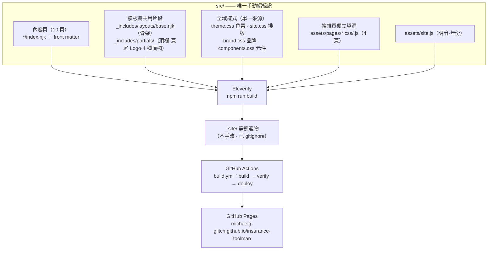

# 保險工具人 · 架構文件（ARCHITECTURE.md）

本文件的「真相」是這個 Git 儲存庫。當 AI 技能、文件或對話與本檔不一致時，以本檔與實際程式碼為準。

## 網站地圖（10 頁）

```
保險工具人 insurance-toolman
│
├── /                                        首頁（三入口：工具 / 觀念 / 問答）
│
├── /tools/                                  實用工具分類（自動收集）
│   ├── /tools/travel-card/                  快樂旅平卡投保備忘  〔元件頁 · 富邦商品〕
│   ├── /tools/road-rescue/                  道路救援自助指南    〔art-directed〕
│   ├── /tools/compulsory-insurance/         強制險申請不求人    〔art-directed〕
│   ├── /tools/mobile-scan/                  手機掃描不求人      〔art-directed〕
│   ├── /tools/mobile-pdf-sign/              手機 PDF 簽名不求人 〔元件頁〕
│   └── /tools/ios-signature/                iPhone 建立簽名檔   〔元件頁〕
│
├── /learn/                                  保險觀念分類（自動收集）
│   └── /learn/car-accident/                 車禍處理 SOP        〔art-directed〕
│
├── /qa/                                     常見問答            〔純文字 + 手風琴〕
│
└── /about/                                  關於保險工具人      〔純文字〕
```

## 建置流程



只有兩個「單一來源」需要記住：

1. **樣式**：`theme.css`（色票）＋ `site.css`（排版）＋ `brand.css`（品牌）＋ `components.css`（元件）。任何新頁面只要套用這些來源，風格就自動一致，不要另寫色票或重複樣式。
2. **骨架**：`base.njk` ＋ `_includes/partials/`。新增頁面 = 寫一個 `index.njk` 並填 front matter，其餘全是繼承。

## 目錄結構

```
src/
├── index.njk                      首頁
├── about/index.njk                關於
├── qa/index.njk                   問答
├── tools/                         工具分類頁 + 各工具子資料夾
│   ├── index.njk                  分類頁（由 collection 自動列出）
│   └── <slug>/index.njk           一支工具一頁
├── learn/                         觀念分類頁 + 各觀念子資料夾
│   ├── index.njk                  分類頁（由 collection 自動列出）
│   └── <slug>/index.njk           一篇觀念一頁
├── _includes/
│   ├── layouts/base.njk           頁面骨架
│   └── partials/                  共用片段（頂欄、頁尾、Logo、4 種頂欄）
├── _data/icons.js                 觀念頁卡片圖示表
└── assets/
    ├── theme.css                  色票（明暗）
    ├── site.css                   全域排版
    ├── brand.css                  品牌
    ├── components.css             可重用元件（警示框、步驟、檢核清單）
    ├── site.js                    明暗切換 + 年份
    └── pages/                     複雜頁的獨立 CSS/JS（4 頁）
```

## 頁面分級（新增頁面時先選等級）

| 等級 | 用於 | 需要做的 |
|---|---|---|
| **純文字頁** | about、qa | 預設模板，只寫內容 |
| **元件頁** | 需要步驟／檢核／警示的說明頁 | front matter 加 `components: true` |
| **art-directed** | 需要獨立頂欄或專屬版面、互動 | 加 `header:` 或 `artDirected: True` + `extraCss`/`extraJs` |

新主題一律先走最輕的「純文字頁」，真的需要互動再升級，勿預先做出 art-directed。

## Front matter 欄位

| 欄位 | 必要 | 說明 |
|---|---|---|
| `layout: base.njk` | 是 | 一律這支骨架 |
| `title` | 是 | 標題＋`｜保險工具人` |
| `description` | 是 | meta description |
| `ogUrl` | 建議 | 加 og:url，提升分享預覽 |
| `activeNav` | 是 | `tools`／`learn`／`qa`／`home` |
| `license` | 是 | `nd`（工具頁）或省略（預設 SA） |
| `header` | 選 | `accident`／`compulsory`／`road-rescue`，否則標準頂欄 |
| `components: true` | 選 | 元件頁才加 |
| `artDirected: True` + `extraCss`/`extraJs` | 選 | 複雜頁才加 |
| `tags` + `order` | 是※ | ※工具/觀念葉子頁：`tags: toolItem`／`learnItem`，`order` 控制分類頁排序 |
| `cardTitle`/`cardBlurb`/`cardTag`/`cardCta`/`icon` | 是※ | ※葉子頁在分類頁顯示的卡片文字資訊 |
| `thumb` | 選 | 葉子頁縮圖路徑（如 `assets/thumbs/<slug>.webp`），供分類頁與「延伸閱讀」卡片用；無縮圖時退回 `icon` SVG |
| `related` | 選 | 相關頁面的 slug 清單，頁尾自動產生「你可能也會想了解」延伸閱讀卡片，建立站內內部連結 |

## 歸檔（自動）

新增工具或觀念頁**不用手改分類頁**。只要在該頁 front matter 加上：

- 工具：`tags: toolItem` + `order` + `cardTitle` + `cardBlurb`（+ 選用 `cardTag`）
- 觀念：`tags: learnItem` + `order` + `cardTitle` + `cardBlurb`（+ 選用 `cardCta`、`icon`）

`src/tools/index.njk` 與 `src/learn/index.njk` 會經由 Eleventy collection 自動列出，依 `order` 排序。「建置中」的預告卡仍是手動維護（尚未有實體頁）。

## 延伸閱讀（站內內部連結）

相關主題彼此互連，是增加可讀性與停留時間的關鍵。做法：

- 在葉子頁 front matter 加 `related:`（列出相關頁面的 `fileSlug`），頁尾就會自動出現「你可能也會想了解」區塊。
- 這個區塊由 `_includes/partials/related.njk` 產生，樣式在 `assets/pages/related.css`（在 `base.njk` 依 `related` 是否存在而載入），卡片依 `order` 順序、用 `thumb` 縮圖（無則退回 `icon`）呈現。
- 因為卡片靠 `collections` 抓取其他頁面的 front matter（`cardTitle`、`cardBlurb`、`thumb`、`icon`），新增或改成對方頁面時，連結會自動更新，不需手動改每一處。
- 縮圖請用「卡通手繪、線條簡單」的 AI 生成圖，統一放在 `src/assets/thumbs/`、`src/assets/illustrations/`，尺寸縮小後存成 `.webp`。

## 命名與授權規則

- 資料夾／檔名一律**英文小寫連字號**（例如 `travel-card`），中文會破壞 GitHub 連結。
- 頁面「標題與內文」可用中文，不受影響。
- `tools/` 頁一律 `license: nd`（禁止改作，因為含電話、時效等不可改動資訊）；`learn/`、`qa/`、`about/` 預設 SA。
- 文案白話、舉例、可查證，移除 AI 提示語；不得使用數字 emoji 編號。

## 部署

1. 本機預覽：`npm run serve`（或 `npm run build` 看 `_site/`）。
2. 推送 `main` 後，GitHub Actions（`build.yml`）自動 build → verify → deploy 到 GitHub Pages。
3. `_site/` 與 `node_modules/` 已 gitignore，不要提交。
4. verify job 會動態檢查：每個 `src/**/index.njk` 都要有對應的 `_site` 產出，因此新增頁面會自動納入驗證，無需改 `build.yml`。

## 內容時效

含專線、額度、費率、申根天數等「數字」的頁面，footer 有「內容核對」日期。頁面內容一有變動，就更新該頁 front matter 的 `reviewed` 欄位（日期），讓訪客知道資訊核對時間。